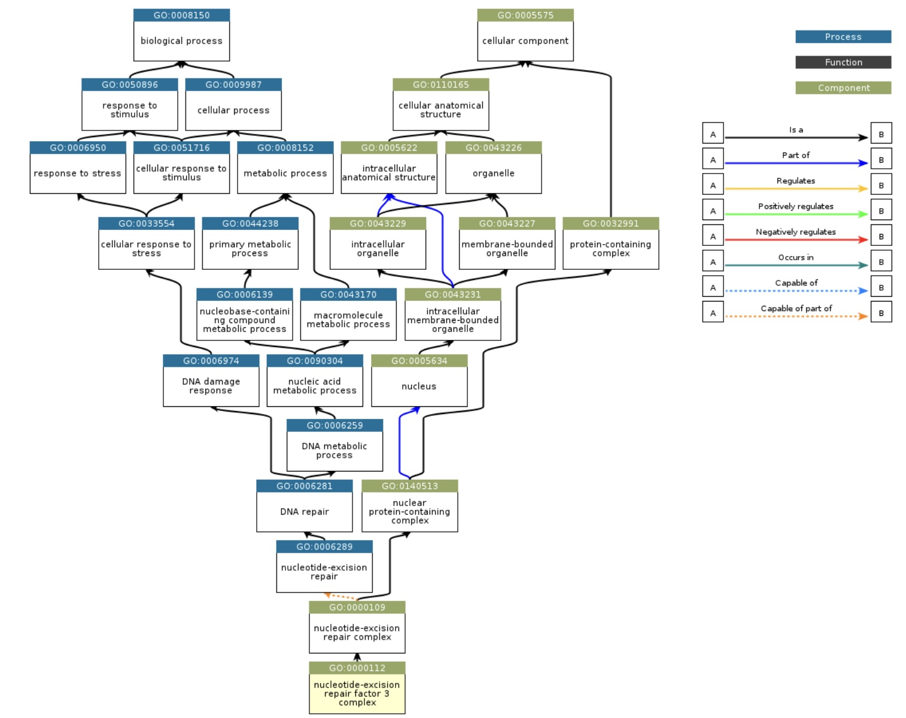

# Introduction

We aim to provide a modern interface to Gene Ontology.
We use the Semantic SQL serialization in SQLite produced
by the [INCAtools project](https://github.com/INCATools/semantic-sql).

This package can be compared to [GO.db](https://bioconductor.org/packages/GO.db).  GO.ddb
aims to capitalize on modern approaches to ontology management and data representation.

# Installation

Before Bioconductor 3.24 is released, use
```
BiocManager::install("vjcitn/GO.ddb")
```

With Bioconductor versions 3.24 and beyond, use
```
BiocManager::install("GO.ddb")
```

# Basic setup

Tidyverse practices are supported.  Within the database,
the GO [CURIE](https://en.wikipedia.org/wiki/CURIE) is in the `id` column.
```{r lk1, message=FALSE}
library(GO.ddb)
library(ontoProc2)
library(dplyr)
go_terms()
```

# Lookups

```{r dolook}
go_terms() |> head() |> collect() |> names()
go_terms() |> dplyr::filter(label %like% "%apopto%")
go_terms() |> dplyr::filter(id %in% c("GO:0042267", "GO:0042268", 
     "GO:0042269", "GO:0042270")) |> dplyr::select(id, ontology, label)
```

A shortcut for term lookup:
```{r docur}
lookup_curie(c("GO:0006953", "GO:0001795"))
```

# Traversals of GO

## Ancestor (generalization) retrieval

`go_ancestors` utilizes the pre-computed 'entailed_edge' table
in the Semantic SQL representation of GO.

```{r doanc}
go_ancestors("GO:0006954", relations = GO_RELATIONS["is_a"]) |>
  inner_join(
    go_terms() |> dplyr::select(ancestor_id = id, label),
    by = "ancestor_id"
  )
```

## Descendant

```{r dodesc}
go_descendants("GO:0006954", relations = GO_RELATIONS["is_a"]) |>
  inner_join(
    go_terms() |> dplyr::select(descendant_id = id, label),
    by = "descendant_id"
  )
```

# Cross-ontology activities

## Quick overview of RDF and ontological entailments

Briefly, the fundamental representation of Gene Ontology
is RDF (Resource Description Format).  Each ontological
assertion (statement) has the form of an ordered triple (subject, predicate,
object).

All the implications of statements in Gene Ontology are
available in the Semantic SQL representation.  "Implication"
here refers to derivability in a logical system implemented
in an OWL reasoner.  See [OAK (ontology access kit)](https://incatools.github.io/ontology-access-kit/guide/relationships-and-graphs.html#further-notes-on-owl-and-graph-projection)
for more background.

## Common predicates

To express certain concepts *precisely*, references to external ontologies
are employed.  

```{r lkee}
go_entailed_edges() |> dplyr::select(predicate) |> 
   group_by(predicate) |> summarise(n=n()) |>
   arrange(desc(n))
```

Let's check on the interpretation of a few of these
frequently encountered CURIEs.

### Some lookups in Relational Ontology

```{r lknew}
roref = semsql_connect(ontology="ro")
goref = semsql_connect(ontology="go")
tbl(roref@con, "rdfs_label_statement") |> filter(subject %in% c("RO:0002131", "RO:0000057",
   "RO:0018038")) |> as.data.frame() |> DT::datatable()
```

### Some lookups for Basic Formal Ontology

The BFO statement tables are not illuminating with respect to
definitions.
```{r lkbfo}
tbl(goref@con, "rdfs_label_statement") |> filter(subject %in% c("BFO:0000050", "BFO:0000051")) |>
  as.data.frame() |> DT::datatable()
```

## Decoding external predicate CURIEs

We can use ontoProc2 to help resolve details
of predicates used to state relationships beyond those
related to class membership ("is a", "part of").

### Learning about an ontology

The following code probes the first 20 statements
available in the Semantic SQL representation of BSPO.
There is in principle no guarantee that such a search
would yield useful records.

```{r trybs, message=FALSE}
library(ontoProc2)
library(DT)
bspo_ref = semsql_connect(ontology="bspo")
bspo_ref
tbl(bspo_ref@con, "statements") |> head(20) |>
   collect() |> datatable()
```

### Statements related to a selected CURIE 

In this example we retrieve all statements with *subject*
"BSPO:0000098", which occurs with some frequency as a *predicate* in the
entailments of GO.

```{r trybs2, message=FALSE}
library(ontoProc2)
library(DT)
bspo_ref = semsql_connect(ontology="bspo")
bspo_ref
tbl(bspo_ref@con, "statements") |> filter(subject=="BSPO:0000098")  |> 
   collect() |> datatable()
```

# Migrating from GO.db

## AnnotationDbi "select"

The `select` procedure of AnnotationDbi can be replaced by a filter
on `go_terms`.
```{r lkgodb}
library(GO.db)
AnnotationDbi::select(GO.db, keys="GO:0006954", 
  columns=c("TERM", "DEFINITION", "ONTOLOGY"))
```

Similar content is provided using `go_terms`:
```{r doddb}
GO.ddb::go_terms() |> filter(id == "GO:0006954") |> as.data.frame()
```

## Environments

The GO.db package includes environments for efficient
management of key-value pairs.

We'll illustrate migration activities for one, the
management of generalization of a selected concept via
traversal of the GO graph.
Here we use GO:0000112, denoting nucleotide-excision
repair factor 3 complex.  A view of the graph is provided here.
Note that we do not include in this example any edges
other than "is a" and "part of", although other
edge types can be explored with the "entailed_edge" table.



```{r lk1env}
ls("package:GO.db")
get("GO:0000112", GOCCANCESTOR)
```

We use `go_ancestors` to obtain this information.
```{r do112}
lk112 = go_ancestors("GO:0000112") |> as.data.frame()
lk112
```
Filtering down to the relevant GO terms:
```{r cont112}
lk112 |> dplyr::filter(grepl("^GO:", ancestor_id))
```

In summary, migration of AnnotationDbi-dependent code
should be possible, although different functions and
data structures will be encountered.  If a particular
legacy computation seems infeasible with GO.ddb, please
raise an issue.  We do not plan to *update* AnnotationDbi
or GO.db in Bioconductor 3.24 or beyond, although the
GO.db package will remain available with 2026 content.
